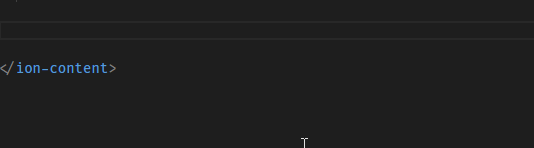

### Ionic 4 code snippets

prefix `i4-` 

Based off of [ionic 4 component documentation(beta)](https://beta.ionicframework.com/docs/api/select-option)

Some gotchas when working with the snippets

#### Removing attributes 
Most of the snippets give you the option to remove the whole attribute if you do not want it. For example if you 
type `i4-button` the first active tab item is `color="primary"`. You can just `backspace` to remove this attribute
if you just want the default button color. **However** the button `color` attribute has a list of options to choose,
and so the next tab in the snippet will be a list of those options**,
You just need to `backspace` out of the array selection and then tab into the next part of the snippet
##### ** I am not sure how to get around that issue - this issue is open [here](https://github.com/Microsoft/vscode/issues/57486)

| Shortcut Code | Component | Options |
| ------------- | --------- | --------|
| i4-avatar | `ion-avatar` with nested `img` tag | *slot* |
| i4-button-back | nested `ion-back-button` in ion-buttons tag | *defaultHref* |
| i4-backdrop | `ion-backdrop` | *tappable*; *visible*; *stopPropagation* |
| i4-backdrop-dynamic | `ion-backdrop` | *same as above, but options are `[]`* |
| i4-badge | `ion-badge` | *color*; *slot*; |
| i4-button | `ion-button` | *color*; *href **or** (click)*; |
| i4-button-detailed | `ion-button` | same as above, but with *routerDirection*; *size*
| i4-button-full | `ion-button` | same as above, but with *fill*; *type*; *expand*; *round*; *strong*;
| i4-button-icon-left | `ion-button` with nested `ion-icon` on left | *color*; *href **or** (click)*; *icon*
| i4-button-icon-right | `ion-button` with nested `ion-icon` on right | *color*; *href **or** (click)*; *icon*
| i4-button-icon-only | `ion-button` with nested `ion-icon` only | *color*; *href **or** (click); *icon*
| i4-buttons | `ion-buttons` | *slot*
| i4-icon | `ion-icon` | *icon*
| i4-card | `ion-card` with nested subtitle, title and content | *color*;
| i4-checkbox | `ion-checkbox`| *color*; *slot*
| i4-chip | `ion-chip`| *color*; 
| i4-chip-label | `ion-chip` with a nested `ion-chip-label` | *color*; 
| i4-chip-icon-left | `ion-chip` with a nested `ion-chip-label` & `ion-icon` on left | *color*; *icon*;
| i4-chip-icon-right | `ion-chip` with a nested `ion-chip-label` & `ion-icon` on right | *color*; *icon*
| i4-chip-icon-button | `ion-chip` with a nested `ion-chip-label` & `ion-icon` on right | *color*; *icon*
| i4-chip-button | `ion-chip-button` | *color*, *fill*
| i4-datetime | `ion-datetime` | *placeholder*;
| i4-datetime-item | `ion-datetime` nested in an `ion-item` with an `ion-label` | *position*; *placeholder*;
| i4-fab | `ion-fab` | *none*;
| i4-fab-full | `ion-fab` | *vertical*; *horizoontal*; *edge*; *slot*; *edge*
| i4-fab-button | `ion-fab-button` | *color*;
| i4-fab-list | `ion-fab-list` | *side*;
| i4-fab-buttons | `ion-fab-list` with 3 nested `ion-buttons` | *side*;
| i4-footer | `ion-footer` | *none*;
| i4-header | `ion-header` | *none*;
| i4-hide-when-mode | `ion-hide-when` | *mode*;
| i4-hide-when-media-query | `ion-hide-when` | *mediaQuery*;
| i4-hide-when-orientation | `ion-hide-when` | *orientation*;
| i4-hide-when-platform | `ion-hide-when` | *platform*;
| i4-hide-when-size | `ion-hide-when` | *size*;
| i4-img | `ion-img` | *src*; *alt*;
| i4-img-dynamic | `ion-img` | *same as above, but options are `[]`
| i4-infinite-scroll | `ion-infinite-scroll` | *threshold*; *(ionInfinite)*; *position*;
| i4-infinite-scroll-content | `ion-infinite-scroll-content` | *loadingSpinner*; *loadingText*;
| i4-input | `ion-input` | *type*;
| i4-item | `ion-item` | *color*;
| i4-item-detail | `ion-item` with detail | *color*;
| i4-item-icon | `ion-item` with detail icon | *color*;
| i4-item-divider | `ion-item-divider` | *none*;
| i4-item-group | `ion-item-group` | *none*;
| i4-item-sliding | `ion-item-sliding` | *none*;
| i4-item-sliding-options | `ion-item-options` | *side*;
| i4-item-sliding-option | `ion-item-option` | *color*; *(click)*;
| i4-label | `ion-label` | *none*;
| i4-label-full | `ion-label` | *color*; *position*;
| i4-list | `ion-list` | *none*
| i4-list-full | `ion-list` |  *lines*; *inset*;
| i4-list-with-items | `ion-list` with 4 neested items | *none*;
| i4-list-header | `ion-list-header` | *color*;
| i4-menu | `ion-menu` | *none*;
| i4-menu-full | `ion-menu` | *side*; *type*; *swipeEnabled*;
| i4-note | `ion-note` | *color*;
| i4-radio | `ion-radio` | *color*; *slot*;
| i4-radio-group | `ion-radio-group` | *none*;
| i4-range | `ion-range` | *color*; *min*; *max*; *pin*;
| i4-range-labels | `ion-range` with 2 labels | same as above
| i4-range-icons | `ion-range` with 2 icons | same as above
| i4-refresher | `ion-refresher` | *slot*; *(ionRefresh)*;
| i4-refresher-full | `ion-refresher` | *slot* *pullMax*; *pullMin;* *snapbackDuration*; **closeDuration*; *(ionRefresh)*;
| i4-refresher-content | `ion-refresher-content` | *pullingIcon*; *pullingText*; *refreshingSpinner* *refreshingText*
| i4-reorder | `ion-reorder` | *slot*;
| i4-reorder-group | `ion-reorder-group` | *none*;
| i4-reorder-full | `ion-reorder-group` with 2 nested items | *none*;
| i4-ripple-effect | `ion-ripple-effect`| *none*;
| i4-router | `ion-router` | *none*;
| i4-route | `ion-route` | *component*; *url*;
| i4-router-outlet | `ion-router-outlet` | *stack*; *name*;
| i4-searchbar | `ion-searchbar` | *placeholder*; *animated*; *showCancelButton*; *cancelButtonText*;
| i4-segment | `ion-segment` | *color*;
| i4-segment-button | `ion-segment-button` | *(ionSelect)*;
| i4-segment-full | `ion-segment` with 2 nested `ion-segment-buttons` | *(ionChange)*; *value*
| i4-select | `ion-select` with `ion-select-option` | *placeholder* *interface* 
| i4-select-option | `ion-select-option` | *value*;
| i4-show-when-mode | `ion-show-when` | *mode*;
| i4-show-when-media-query | `ion-show-when` | *mediaQuery*;
| i4-show-when-orientation | `ion-show-when` | *orientation*;
| i4-show-when-platform | `ion-show-when` | *platform*;
| i4-show-when-size | `ion-show-when` | *size*;
| i4-skeleton-text | `ion-skeleton-text` | *width*;
| i4-skeleton-text-paragraph | `ion-skeleton-text` with nth items | *width*;
| i4-slide | `ion-slide` | *none*;
| i4-slides | `ion-slides` with 4 `ion-slide`'s | *pager*; *options*;
| i4-spinner | `ion-spinner` | *color*; *name*;
| i4-split-pane | `ion-split-pane` | *when*;
| i4-split-pane-full | `ion-split-pane` with nested menu and router outlet | *none*;
| i4-tab | `ion-tab` | *label*; *icon*; *href*;
| i4-tabs | `ion-tabs` | *color*;
| i4-tabs-full | `ion-tabs` with 3 `ion-tab`'s | *color*; *icon*
| i4-text | `ion-text` | *color*;
| i4-textarea | `ion-textarea` | *color*;
| i4-thumbnail | `ion-thumbnail` | *slot*;
| i4-title | `ion-title` | *none*;
| i4-toggle | `ion-toggle` | *none*;
| i4-toolbar | `ion-toolbar` | *color*;
| i4-virtual-scroll | `virtual-scroll` as `ion-list` with `ion-item` | *[virtualScroll]*; *virtualItem*;